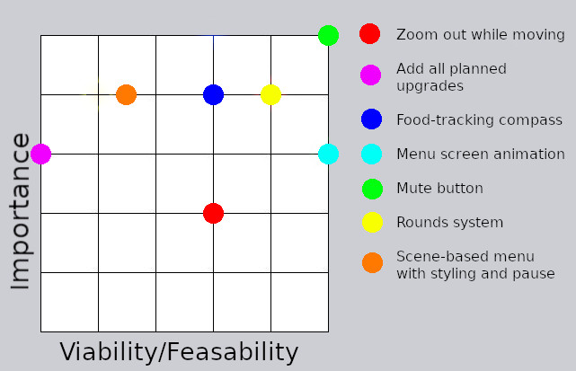
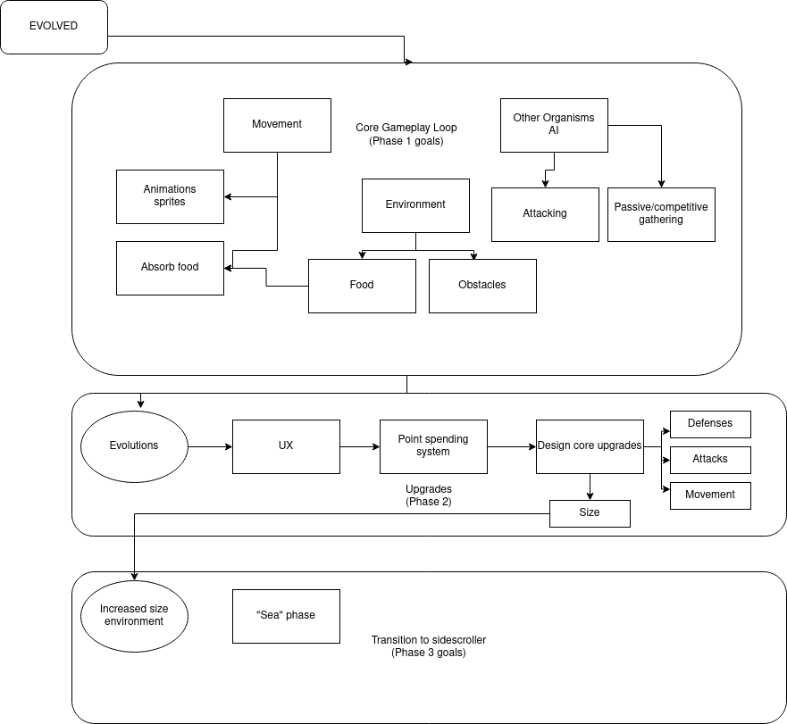

# EVO: Evolution

***
## Play it now!
[Live version here](https://jdygard.github.io/EVO/)

If you're evaluating the game and don't want to work to advance, simply type "debugMode = true" into the console at the menu screen to get 10 free evolution points at the beginning of each round. Or you can change it on line 102 in game-settings.js.
***
## Table of contents
***
1. [Introduction](#Introduction)
    
    i. [Project Goal](#Project-goal)

2. [Development Planes](#Development-planes)

    i. [Strategy](#Strategy)

    ii. [Scope](#Scope)

    iii. [Structure](#Structure)

    iv. [Skeleton](#Skeleton)

    v. [Surface](#Surface)

3. [Original development plan](#Original-development-plan)

    i. [Phase 1](#Phase-1)

    ii. [Phase 2](#Phase-2)

4. [Current features](#Current-features)

    i. [Features](#Features)

    ii. [Unplanned features](#Features-not-originally-planned)

    iii. [Unimplemented features](#Unimplemented-features)

5. [Deployment and Testing](#Deployment-and-testing)

    i. [Deployment](#Deployment)

    ii. [Testing](#Testing)

6. [Known Issues](#Known-issues)    
7. [Bugs](#Bugs)
8. [Credits and references](#Credits-and-references)

    i. [Technologies used](#Technologies-used)

    ii. [Code credits](#Code-credits)

    iii. [Visuals credits](#Visuals-credits)

    iv. [Audio credits](#Audio-Credits)

    v. [Acknowledgements](#Acknowledgements)

***
# Introduction
Evo is a game about evolution. Each round represents a stage in the evolution of a lifeform, and through garnering evolution points by eating food or killing the competition and eating their food, the player can select new evolutions to advance to the next round. The goal is to get to round 4 and evolve the 'size' upgrade.

All art, code and game concepts were the (more or less, it's similar to Spore's first stage) original work of the author, Joel Dygard, with the exception of the code credited at the end of this document. No tutorial was followed to make this game as whole, but bits were used as guiding light to how to use the Phaser 3 library.

[Back to top](#Table-of-contents)
## Project Goal
Evo is designed to provide a challenging but surmountable interactive experience for the user. This is the second of four Milestone projects for Code Institute, required for graduation.

Most of the coding required will be JavaScript, in the forms of traditional JavaScript, MatterJS and Phaser 3.

### Player goals

The player wants to:

- Have fun
- Be challenged
- Explore the different avenues of evolution
- Overcome the game's challenge

### Developer goals

The dev wants to

- Learn to code in MatterJS
- Demonstrate their ability to write in JavaScript
- Deploy a project that can be displayed in their portfolio

[Back to top](#Table-of-contents)
***
## User stories

### As a player, I like:

1. Being challenged
2. Learning a system
3. Exploring an environment
4. Being able to control the way sounds are presented
5. Getting positive feedback for accomplishments
6. Overcoming challenges

[Back to top](#Table-of-contents)
***

# Development planes

Development followed generally the concept of development planes. As shown below, development began in what is traditionally the third part: the structure. From there, we worked backward, and then forward.

## Strategy

The following categories of people might be interested in Evo:

- New and returning players

- People interested in exploring a fun challenge

- People who aren't capable of completing the entire game

### Requirements

The game needs to:

- Begin with an easy stage of gaining familiarity, and then escalate in difficulty and complexity.

- Reward positive progress

- Show the user negative feedback

- Show the user their score and health

- Entertain!

### Strategy table

### Zoom out while moving

This was a variable zoom that scales the game down to reveal more of the play area as the player object moves faster. It would center on the area where the player was headed.

This was tested quite a bit, but making the UI keep its scale while changing the scale of the play area proved very difficult as it wasn't designed with this concept in mind from the beginning. It was, unfortunate, infeasible for the time frame of this project.

### Add all planned upgrades

All of the planned upgrades are outlined below in the original development plan. There we 13 planned upgrades, which, given how the animation system wound up working, would have constituted hundreds of individually developed animations. This would entail over 30 hours of additional animation work, and was deemed unnecessary given the goals of the development.

### Food-tracking compass

This would be an arrow or other indicator showing the nearest food bit.

Given the player's advantage in planning and navigation, this was deemed unnecessary due to the timeframe of the project.

### Menu Screen animation

An animation introducing the theme and feel of the game.

This wound up taking about 4 hours of work, and the benefit to the "Wow" factor of the game is high.

### Mute button

This was very important to the development of a game with sounds. To decrease the intrusiveness of the sound, a mute button was deemed very important and very feasible.

### Rounds system

A system of rounds instead of piecemeal evolution contributes to the "arcade" style of the game. Though difficult, it was deemed important enough to tackle.

### Scene-based menu with styling and pause

A system wherein a small external scene would be instantiated in the gameplay scene to allow the user to peruse evolutions and view information about them.

While important, the time investment involved with making this type of menu seemed to be very high. A strong attempt was made to implement it. However, it was deemed that since this solution was centered highly in the Phaser 3 library and not terribly applicable elsewhere, it would not be a useful skill to develop from an educational standpoint. This was unfortunately scrapped for a less attractive, easier solution from a plugin.

## Scope

The game should have:
- A complete game loop with win and loss conditions
- Choices made by the player that impact how they achieve the win condition
- Different strategies to achieve the win condition
- Feedback
- Clear objectives and progress indication
- Ability to control the game's sound
- A clear visual style

## Structure

The structure of the game is covered in the [Original development plan](#Original-development-plan)

## Skeleton

The game was designed with the intent that the form of the game would follow the function of the game. Initial placeholder graphics were not kept but followed the intended color scheme of the game more or less.

However, the general theme of the game was to be "Looking through a microscope at micro-organisms competing for resources" with an arcade feel.

## Surface:

- The color scheme was chosen to cover several themes
    - Blue-green as the color of the ocean
    - Gold as a contrast to the blue-green
    - Bright green for the arcadey health bar
    - Dark green for the color of the deep ocean
    - A light purple for the arcade-style indication of "bad guy"

    

- Animations were deemed to be very important for the sense of swimming, and are 4 frames each. There are a total of 64 animations in use in the game.

- A menu screen that impresses the intended feel of the game is important

- Text indicators that fit the theme of the game and give a sense of the fun, arcade style are important. "Lucky Guy" font found on Google Fonts was chosen for this.

# Original development plan

We're going to start with core features, creating a framework upon which the rest of the game can be built. 
The phases are arranged such that each phase rounds out a gameplay loop, and is thus a "complete game." This will allow us to turn in a complete project no matter which phase is completed, even the first.

[Back to top](#Table-of-contents)

***
## Phase 1
### The framework
1. Moving player

    i. Controls for rotation

    ii. Controls for locomotion

    iii. Physics for locomotion

2. Scrolling scene
3. Obstacles with bumping physics

    i. Floating obstacles, i.e. rocks

    ii. Static obstacles, i.e. rocks, environment boundary

4. Collectible plant food
5. EVO point tally
6. Other organisms
7. Ability to attack other organisms
8. Other organism behavior 

    i. Competitive gathering, i.e. herbivore/omnivore attempting to gather before the player

    ii. Aggressive behavior, i.e. carnivore/omnivore deciding whether to attack, and harming the player

    iii. Dropping collectibles

9. Graphics:

    i. Sprites

    ii. Animations

    iii. Environment

[Back to top](#Table-of-contents)
***
## Phase 2
### Evolution
1. Proper UX

    i. EVO point tally
    
    ii. Health bar

    iii. Spending EVO points and menu

2. Upgrades

    i. Movement upgrades, stats and graphic representation

        a. Cilia (Small appendages on the sides that propel the organism. Moderate speed, moderate rotation)
        b. Flagellum (Long hairlike filament like on a sperm, high speed, poor rotation)
        c. Cytoplasmic flow (Rotation-independent free movement. Moderate speed.)
        d. Streamlined body (Requires size increase, gives more momentum to locomotion)
        e. Pseudofin (Requires size increase, high speed, high rotation)
        f. Swim bladder (Requires size increase, very high speed in bursts, poor rotation)

    ii. Defenses upgrades, stats and graphic representation

        a. Stiffened flanks (Incompatible with cilia and cytoplasmic flow, immunity to small sized creatures without jaws or spikes.)
        b. Chitinous shell (Requires size increase. Incompatible with cilia and cytoplasmic flow, immunity to similarly sized creatures without spikes, very reduced movement speed)
        c. Scales

    iii. Attack upgrades, stats and graphic representation

        a. Spike
        b. Poisoned spike (Requires size increase)
        c. Pseudoteeth
        d. Jaw (Requires size increase)
        e. Slime (Leaves a path of reduced movement speed behind, requires cytoplasmic flow or cilia)

    iv. Size upgrade

[Back to top](#Table-of-contents)
***
# Current features
The actual development of the game went roughly according to the plans outlined above. I will go through the plan above and show how each part was implemented, and document the deviations. Note that these features are delved into in much more detail in the [testing documentation](TESTING.md).
***
## Features
### 1.1. Moving the player
Keyboard controls are very simple keybindings to the physics engine. Early designs of the touch controls used a joystick plugin, but that was later scrapped for a simpler "touch to move" more automatic system.
### 1.2. Scrolling scene
This was accomplished by binding the camera view to the player object and providing a scene with edge boundaries for both objects and the camera view.
### 1.3. Obstacles with bumping physics
Rocks were toyed around with but they never looked quite right in the scale of the game. I didn't want to go to the trouble of drawing them all by hand, so I chopped up a picture of bacteria and slightly modified them to be floating debris as the only decoration in the game.
### 1.4. Collectible plant food
The small bits of green food were implemented exactly as intended. They wound up being collected in an array to make them easier to manage. The array is accessed to:
- Determine when to generate new food after all food is eaten
- Determine a target for each enemy
- Determine which food has been eaten
### 1.5. EVO point tally
EVO points are kept in the data set attached to the health bar. They are also displayed in a void in the health bar.
### 1.6. Other organisms
These are the enemies the user must compete with. They share animations with the player object but in a different color.
### 1.7. Ability to attack other organisms
This is reflected in the Hit Points(HP) of the other organisms, and in the weapon upgrades that can be evolved by the player.
### 1.8. Other organism behavior
There is a reference here to herbivore/carnivore. Originally there was an idea to implement different food types that could only be eaten by certain head upgrades. That was deemed too complex and scrapped for a simpler system.

Everything else in this item was implemented: Enemies compete to gather resources, attack the player when they have the required upgrades, and drop edibles when defeated. The systems involved with this are discussed in greater detail in the [testing documentation](TESTING.md)
### 1.9. Graphics
The play area was drawn by me to resemble "looking at a slide through a microscope."

The sprite animations were drawn and implemented by me using [GIMP](#Technologies-used) and the simplified animation builder present in Phaser 3. The animation keys are codes built by the upgrade selector for both the enemy objects and player object.

See [game-settings.js](js/game-settings.js) lines 248-251 for more details. I was pretty proud of this idea.

[Back to top](#Table-of-contents)
***
### 2.1. Proper UX
The health bar and spending EVO points wound up being moved to almost the end of the development process by necessity: Much of the other systems needed to be in place to actually interact; i.e. it's hard to build a health bar when the player has no hit points, and it's hard to build an evolution puchase system when there's nothing yet to purchase.
### 2.2 Upgrades
Because of how graphics and animations wound up being built (The plan was a modular design with replaceable body parts rather than distinct animations for each set of upgrades) the time cost of implementing even a single additional upgrade was exponentially higher than the last.

This system caused the game to suffer more for variety than originally intended, creating a more arcade-game feel than the RPG feel that was the goal.

I would prefer to have built everything modularly, and infinitely expandable. If the plan were to make this a very long project with dozens of upgrades, it would have justified the work. For a limited project, I think this implementation was acceptable.

[Back to top](#Table-of-contents)
***
## Features not originally planned
### Menu screen animation
This animation was built from an image found on Pexels and the tween methods available in matterJS. The underwater animation effect was built in [GIMP](#Technologies-used).

### "Rounds" system
While building the game, the lack of a sense of structure gave the game a "sandbox" feel, without enough features to justify that setting. It was decided then, to implement rounds to give the game an "arcade" feel. It also gave a simplified reason to give enemies upgrades, rather than having them opportunistically take upgrades based on how many points they'd gathered.

### Rex's UI plugin
The original plan for the evolution upgrade menu was to produce another scene to serve as the menu, and have it appear as a "scene within scene" when the evolve button was clicked. This proved to be difficult, and I spent a couple of days on it. It was decided that since this solution was very library specific that it had little real-world educational value, and a cheaper workaround was found.

I had planned to keep this project completely plugin-free, but this seems like a fair compromise.

[Back to top](#Table-of-contents)
***
## Unimplemented features
The "Phase 3" section in the development tree image at the top of this section refers to "transition to sidescroller," which was a transition to a whole new perspective, and fish bodies. This was obviously a huge reach goal and the reality of a 2-4 week development process made that a non-starter.

[Back to top](#Table-of-contents)
***
# Deployment and testing
## Deployment
This project was developed using Visual Studio Code v1.55.0, and all commit/push commands were performed in the software's terminal.

### Github Pages
1. Log into GitHub
2. Navigate to [the repository](https://github.com/JDygard/EVO).
3. Click "Settings"
4. Scroll to "GitHub Pages"
5. Select a branch.
6. The "GitHub Pages" section should now contain the link to the deployed page.

### Creating a fork
1. Navigate to [the repository](https://github.com/JDygard/EVO).
2. Click "Fork"

### Cloning with GitPod
1. Install GitPod extension.
2. Log into GitHub
3. Navigate to [the repository](https://github.com/JDygard/EVO).
4. Click "GitPod."
 
### Cloning into VSCode
- Note that you will need a virtual server to run the game on your machine locally
1. Navigate to [the repository](https://github.com/JDygard/EVO).
2. Click "Clone or download"
3. Copy the provided URL.
4. Open your terminal
5. Navigate to the desired target directory
6. type 'git clone' and then paste the url.

[Back to top](#Table-of-contents)
***
## Testing

[Testing documentation](TESTING.md) is available in a separate file.

[Back to top](#Table-of-contents)
***
## Known issues
***
### "WebGL warning: texImage: Alpha-premult and y-flip are deprecated for non-DOM-Element uploads." Appears in console

Phaser 3 uses UNPACK_PREMULTIPLY_ALPHA_WEBGL in its current library. It is deprecated but functional according to the Mozilla team: [Relevant bugzilla report](https://bugzilla.mozilla.org/show_bug.cgi?id=1400077)

***
### Game is essentially unplayable on very small screens

The game was designed with accessibility in mind. That being said, by the nature of the game, having a very small screen presents very real problems:

- Putting your finger down on the screen for movement obscures the screen to the point that it is difficult to play normally
- Accessing the evolution menu elements can be challenging with such a small target to tap

As the game logic is quite demanding on processor performance by its nature, many devices with very small screens will be unable to run this game anyway.
***
### Game logic breaks down on slow processors
Because the logic is frame independant, but the physics are frame-bound, when the framerate goes down certain aspects of the game become less consistent. One of the most important aspects is the enemy pathing. An enemy will select a target and start moving toward it at its maximum thrust setting between frame cycles, while adjusting its path every update cycle. When the update cycle is significantly shorter than the framerate, the enemies will simply fly by their intended target and begin circling it. This can't really be resolved in a reasonable timeframe.

We considered adding a warning that framerate/update cycle ratio was becoming unplayable, but that would require a significantly larger pool of data to implement intelligently.
***

### Game speed is very high on high refresh-rate displays
Unfortunately, MatterJS physics is coupled very closely to the framerate of the display being used. This is an issue that has to be accounted for when initially coding how things interact within the canvas.

Having discovered this issue when well into the project, it is beyond the project scope to completely rebuild elements of the game from the ground up at this time.

Resolving this would involve creating a standardized step-timer, and use these ticks to apply force based on time rather than frames.
***
### "Red Food" dropped by enemies is sometimes not able to be eaten
We've tracked this issue down to an issue with the food array.
When the level is generated, 30 food is placed into an array and managed from there. When an enemy dies, two food pieces are generated after the death animation ends, and as part of their generation they are pushed into the same food array.

The issue is that sometimes, one of the two food dropped by the enemy is not edible. Given the time frame of this project, this was considered too minor an issue to look into further.

[Back to top](#Table-of-contents)
***
## Bugs
***
### Mouth sensor contact with world boundary causes crash (Solved)
When the mouth sensor on the Player object makes contact with the world boundary, it assigns assigns a null value to one of the temporary variables within the querying function associated with the sensor. This crashes the game.
This bug has been tenacious as the sensor functions become more complex. 

### Resolution:
We've had to implement a test before each if statement involving encountered variables. Another option would have been to give a value to the world boundary to eliminate
the problem of null values clogging up functions.
***

### Food target .destroy() bug crashes game. (Solved)
This one was a doozy! After adding an enemy and giving them the ability to seek out food, I started getting a repetitive crash from the phaser library. I was destroying something the game was using. I assumed it had to do with the
code I had just added (the pairs loop .on('collisionstart' ) and had a difficult time figuring it out. I tried:
- Moving the foodSprite.destroy() function to the end of, and out of the for loop.
- Updating the entire Enemy class to differentiate it from the player
- Resetting the isSensor objects to differentiate them

### Resolution:
It was only when I noticed that it was only the food being TARGETED by the enemy sprite that I realized the issue. When the targeted sprite was destroyed, the data object on the enemy became null. The game crashed because the control mechanism for the Enemy couldn't target null.

This was fixed by separating the destruction of the sprite into the update method, and forcing all enemy sprites to decide on a new target each time the garbage would empty. This is effective because the eaten food is removed from the targeting array as part of the collision process and thus cannot be retargeted.
***
### Adding the possibility to delete defeated enemies crashes the game (Solved)
When a function discovers that an item has been eaten or that its 'hp' data point has been recuced to 0, it is flagged for garbage cleanup and removed from its object group/array, and assigning it to the garbage variable. Every frame tests the garbage variable for content and destroys it. In the case of eaten food, the garbage emptying function runs the findFood() method to prevent enemies from seeking destroyed food items. When adding the functionality to destroy enemy creatures, many methods started crashing the game. I tried:
- The lazy way out: adding a test to each crashing method to make sure nothing undefined got in

- Rearranging how the object arrays are written to
- Reorganizing the if statements that declare garbage

### Resolution:
In the end, the issue was that even though the garbage variable destroyed its gameObject, it remained assigned to it, and would randomly destroy other objects as part of its functionality, because of how the statement tested the variable. A simple fix solved everything: Once the garbage is destroyed, reset the garbage variable == undefined.
***

### Crash in round 3 (Probably solved)
This may be the most tenacious bug I've yet discovered. Always in round 3, after two rounds have elapsed error-free, the game crashes. It happens when the moveToTarget() method is interrupted in trying to find the angle between the enemy and the target (food). It's almost certainly because it is targeting a food bit that doesn't exist, but I absolutely cannot find where the phantom food is coming from.

1. The food array is cleaned and replaced every round.
2. Food that is eaten is removed from the array before being removed from the game.
3. The targeting mechanic targets food using the array

### Conclusion:

I've put a check at the beginning of all loops that triggered the crash that tests that the food array has some length before going through the loop. This has stopped instances of the crash, but as I never found a reliable way to recreate the crash, I don't know if it is completely fixed.
***

### Enemy pathing results in driving loops (Solved)
Occasionally when the enemy is pathing toward their target, they'll decide to perform an entire loop rather than go directly to their target. This is due to the simplicity of the target acquisition mechanism. It compares the angle between the enemy object and the target, to the angle of the enemy itself. Since the result can be negative, when the target is down and left of the enemy, it will loop around instead of aiming straight toward the target. Fixing this will require testing for the bug condition.

### Resolution:
After logging the values involved in the turning calculations, I realized there are dead zones where the values fall out of the expected range, forcing the enemies to do a full loop and find an acceptable range again. In certain situations, this would result in a repeating loop as the values would never fall within the range again. This was fixed with the help of a [stackoverflow](https://stackoverflow.com/questions/1878907/how-can-i-find-the-difference-between-two-angles) question and answer.
***

### WebGL MAX_TEXTURE_SIZE (Solved)
After converting my myriad textures into a master spritesheet, my sprites stopped rendering properly, appearing as small black boxes instead. I discovered that this is due to specific browser/hardware combinations having very low texture size limitations.

### Resolution:
For accessibility, I added an if statement that makes sure the max permitted texture size is enough to accommodate the size of the intro menu animation. If it doesn't, a static version of the menu graphic is shown.
I also discovered that textures are treated like the next largest squared integer, i.e. a 5x2 px image is treated as 8x8, a 126x12 is 128x128 etc. By packing my master spritesheets into as square a version as possible, I was able to squeeze it down to the lowest possible WebGL maximum texture size (Chrome on mobile.)
***
### Game does not pause when menu is open (Partially solved)
This is another example of "if only," because if I'd built the game with this in mind, it would be relatively easy to do. Same with that if I had built the menu as a separate scene (as I had planned) then I could have paused the
gameplay scene while the menu was open.

### Resolution:
I simply put an if statement in front of all player and enemy controls, and a variable that switches on and off when the menu opens and closes. It is an imperfect solution, I would rather that all animations and motion paused when the menu opens. As it stands, when the menu is open, all objects continue drifting due to the physics engine, but at least the player and enemies drift to a stop very quickly.
***

[Back to top](#Table-of-contents)
***

# Credits and references
## Technologies used
1. [Phaser 3](https://photonstorm.github.io/phaser3-docs/index.html): Phaser 3 and the API documentation were the principal technologies used to generate the canvas and manage game objects and their interactions.
2. [Javascript](https://en.wikipedia.org/wiki/JavaScript): Javascript comprises 99% of this program.
3. [Favicon converter](https://favicon.io/favicon-converter/): Used to make the favicon.ico and associated files.
4. [GNU Image Manipulation Program (GIMP)](https://www.gimp.org/): Used extensively making animations and sprites
5. [CSS](https://en.wikipedia.org/wiki/CSS): There are 7 lines of CSS.
6. [HTML5](https://en.wikipedia.org/wiki/HTML5): There are 25 lines of HTML, used to load the canvas and JS used there.
7. [Google Fonts](https://fonts.google.com/): Used for the two fonts used in this program, Roboto and Luckiest Guy Bold.

[Back to top](#Table-of-contents)
***
## Code credits
1. [Samme's Rotate to Cursor](https://codepen.io/samme/pen/JBwWLN?editors=0010) found in gameplay.js, lines 419-429 and lines 809-820

    To my credit I did have a system in place for this exact process.

    `(Math.2atan(Math.sin(player.location - target.location), Math.cos(player.location - target.location)))`

    However, the arctangent is very processor heavy and I found that my tablet had a hard time running the game after I involved this in a process that updates ~60 times a second. I found this example that did the exact same thing, but much more elegantly and - more importantly - less taxing on the hardware.

2. [Michael Hadley's code example](https://codesandbox.io/s/5vlzl8j9vp?file=/js/player.js) found in objects.js, lines 20-69.

    This example was coded with a deprecated code simplifying library, and for an older version of the Phaser engine. However, much of the structure and entity interactions are carefully commented and helped immensely in learning about those systems.

3. [Rex's UI plugin](https://rexrainbow.github.io/phaser3-rex-notes/docs/site/ui-overview/) found in rexuiplugin.min.js and game-settings.js lines 132-198.

    Rex's UI plugin was used to build the "Evolve" menu. This made the code lighter, and eased the process of making a complex build menu.

    I didn't want to use any plugins for this project, and spent almost two full days trying to get a "scene within scene" version of the menu working. In the end, I decided that since that method is very library specific that it wasn't very valuable to me as a skill. I found a workaround in this plugin, and built a passable menu instead.

4. [Emanuele Feranto's simple mask tutorial](https://www.emanueleferonato.com/2019/04/24/add-a-nice-time-bar-energy-bar-mana-bar-whatever-bar-to-your-html5-games-using-phaser-3-masks/) found in gameplay.js lines 523-535.

    This was a simple tutorial on using masks. I almost wouldn't have credited it, but I did lift the concept of stepWidth directly from the tutorial.

[Back to top](#Table-of-contents)
***

## Visuals credits

1. Jess Vide's [Blue Ocean Blue Sky](https://www.pexels.com/photo/blue-ocean-under-blue-sky-and-white-clouds-4611748/). 

This image was disassembled and used for the menu screen animation.

[Back to top](#Table-of-contents)
***

## Audio Credits

All game sounds used were found on [Open Game Art](https://opengameart.org/). They are used here under Creative Commons free licensing.

1. Menu music: [Lurid Delusion](https://opengameart.org/content/lurid-delusion) by Matthew Pablo.
2. Game music: [Caves of Sorrow](https://opengameart.org/content/caves-of-sorrow) by Alexander Zhelanov.
3. Menu denial sound: [Bad Sound](https://opengameart.org/content/bad-sound-1) by remaxim.
4. Hit sound effect: [Hit Sound Bitcrush](https://opengameart.org/content/hit-sound-bitcrush) by DaGameKnower.
5. New round sound: [Epic Amulet Item](https://opengameart.org/content/epic-amulet-item) by CosmicD.
6. Game over: [Game Over Music Box II](https://opengameart.org/content/music-box-game-over-ii) by Kim Light Year.
7. Victory: [Win Jingle](https://opengameart.org/content/win-jingle) by Fupi.
8. Eating: [7 Eating Crunches](https://opengameart.org/content/7-eating-crunches) by StarNinjas.

[Back to top](#Table-of-contents)
***

## Acknowledgements

1. Richard Davey, aka Photonstorm, creator of the Phaser 3 library used extensively in this project. He, personally, tirelessly fielded my questions as an active member of his Discord community, and deserves much more than my humble thanks for all of his help.

2. My friends and family for tirelessly enduring every iteration of my game.

3. My mentor Seun Owanikoko for her brusque demeanor and encouragement.

[Back to top](#Table-of-contents)
