# Testing
## Testing protocol
We will be testing each major game element and function as much as possible, making use of the debugMode variable included in the game. debugMode simply gives the player 10 points at the beginning of each round in order to skip the game loop.

# Table of Contents:
1. [Menu scene](#Menu-scene)

    i. [Mute button](#Mute-button)

    ii. [Tap for touch controls](#Tap-for-touch)

    iii. [Press any key to start](#Press-any-key)

2. [Gameplay scene](#Gameplay-scene)

    i. [Player controls](#Player-controls)

    - [Touch controls](#Touch-controls)

    - [Keyboard controls](#Keyboard-controls)

    ii. [Enemy logic](#Enemy-logic)

    iii. [Health bar](#Health-bar)

    - [Evolution menu](#Evolution-menu)

    - [Point display](#Point-display)

    - [Health display](#Health-display)

    iv. [Play area](#Play-area) and camera

    v. [Mute button](#Gameplay-mute-button)

    vi. [Text display](#Text-display)

    vii. [New round](#New-round)

    viii. [Game over](#Game-over)

    ix. [Sensor interactions](#Sensor-interactions)

3. [Validation](#Validation)

    i. [JSHint](#JSHint)

    ii. [WC3 CSS Validation](#CSS-validation)

    iii. [WC3 HTML Validation](#HTML-validation)

# Menu scene
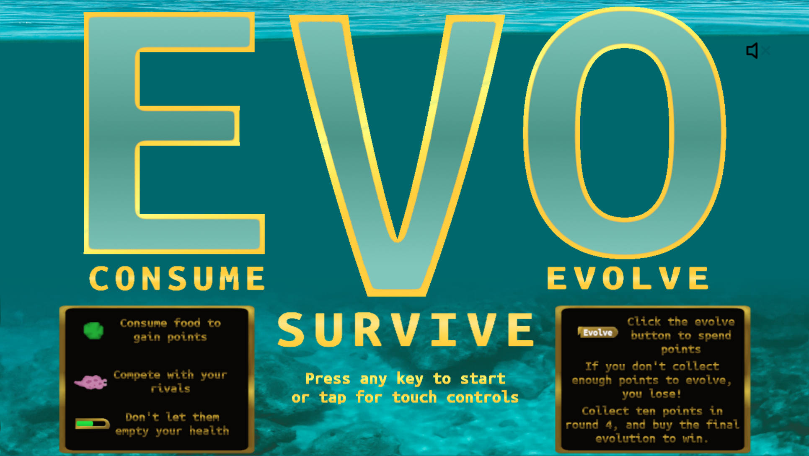

The menu scene features an intro animation, music, a mute button, and instructions. The interactive elements are simple:

[Back to top](#Table-of-contents)

## Mute button

- Clicking the mute button successfully terminates the only sound in the scene: the music. Upon advancing to the gameplay scene using the interactive elements below, the mute state is saved.

- If the mute button is not activated, advancing to the gameplay scene leaves the sound elements active there also.

[Back to top](#Table-of-contents)

## Tap for touch

- Tapping or clicking the interactive "Press any key to start or tap for touch controls" element successfully advances to the gameplay scene, deactivates the keyboard controls and allows the player object to be controlled with touch or mouse controls.

[Back to top](#Table-of-contents)

## Press any key

- If the gameplay canvas is focused, pressing any key successfully advances to the gameplay scene and deactivates touch controls.

[Back to top](#Table-of-contents)

# Gameplay scene
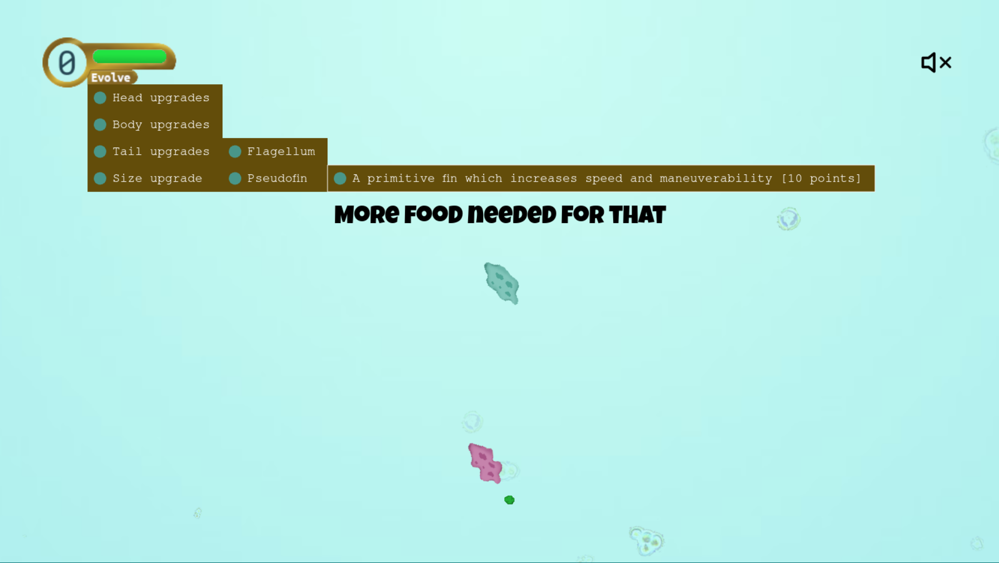

The gameplay scene is a complex set of interactive elements. 
The UI features a healthbar with point and health display with a collapsible evolution menu, and a mute button.

The core game elements are the player object, three enemy objects, food particles, a play area with boundaries, a camera view, and a combination of interactive and passive debris.

[Back to top](#Table-of-contents)
***
## Player controls
The player controls are separated into two categories, and can be found in gameplay.js, lines 845-880. They are read and executed on every update step. They are selected from the menu screen.

Selecting control type testing is enumerated in [Menu screen testing](#Menu-scene)

[Back to top](#Table-of-contents)
***
### Touch controls

Touch controls are designed to be intuitive but effective. Tapping somewhere on the screen causes the player object to orient itself toward that tap as long as it is held. If the pointer is within a range (approx. 170 degrees) of the front of the player object, it will move toward it at the current player speed. In a narrow range (approx. 10 degrees), the rotation mechanism is disabled to prevent wobbling. All player control is disabled when the evolution menu is open.

- Player movement disables as expected when the evolution menu is opened, and resumes when the menu is closed.

- Tapping anywhere on the screen that isn't another touch interactive element causes the player to orient and move as expected.

- During the death message screen and fadeout, movement is disabled, and resumes after reset.

Evolution menu touch control testing is covered in [Evolution menu testing](#Evolution-menu)

[Back to top](#Table-of-contents)

### Keyboard controls

Keyboard controls are oriented around the classic cursor key arrangement. They are very simple, applying thrust on the up arrow key, and rotationspeed on the left and right arrows.

- All elements of this have been thoroughly tested. Control is arrested when the menu is open or the death message is being displayed, and returned afterwards.

Evolution menu mouse control testing is covered in [Evolution menu testing](#Evolution-menu)
***
## Enemy logic

Enemy logic consists largely of two methods, findFood() and moveToTarget() in the gameplay scene class. 

findFood() compares the location of each enemy object with the locations of each food object, both stored in arrays. If the enemy has a weapon, the player is added to and prioritized in this comparison. It compares them against each other until it finds the nearest object, and then stores the information in each enemy's data set.

moveToTarget() retrieves that information, as well as information about the enemy from the enemy data set. It then orients and moves the enemy toward the target object using the same mechanism tested in [Player controls](#Player-controls). It is run once every update cycle.

The logic has no mechanism for avoiding obstacles.

- The enemies target and approach food as expected. Their movement is efficient and looks natural.

- When their targeted food is destroyed, they seek a new target.

[Back to top](#Table-of-contents)
***
## Health bar

[Back to top](#Table-of-contents)
### Evolution menu

The evolution menu has several moving parts and a pretty complex if statement. It is anchored in the Healthbar element from which it springs, and has elements defined in the game-settings.js file. Movement is disabled while the menu is open. Successfully purchasing an upgrade starts the next round.

When the user clicks on a menu item deepest in the tree, logic checks that there a enough points, a required round or upgrade, and that there isn't already a conflicting upgrade. If one of these does not allow the upgrade, a message is displayed, explaining why. It also plays a sound. The priority for message display is wrong round > conflicting upgrade > insufficient evo points > missing required upgrade.

- Menu opens and closes at every stage of the game when the healthContainer is clicked or tapped as expected.

- Every element was tested for completed upgrades in each round. Each one provides the correct animation code, applies the correct upgrade stats, and advances the round as expected.

- Every rejected upgrade plays the correct sound when the game is not muted.
***

### Upgrade slot full

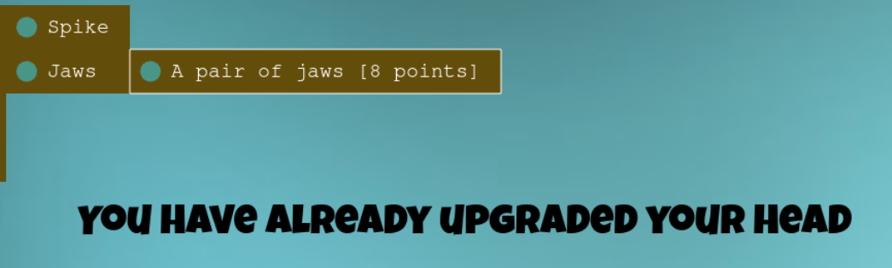
- Attempting to take the jaws upgrade when your head is already upgraded.

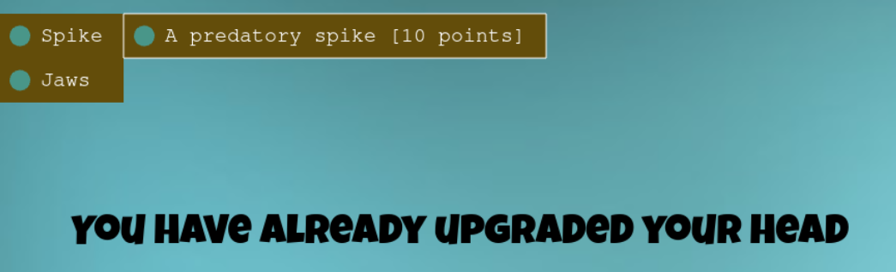
- Attempting to take the apike upgrade when your head is already upgraded.

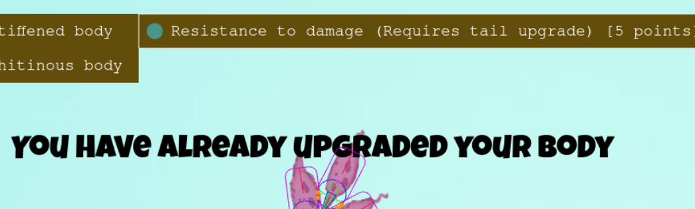
- Attempting to take the stiff body upgrade when your body is already upgraded.

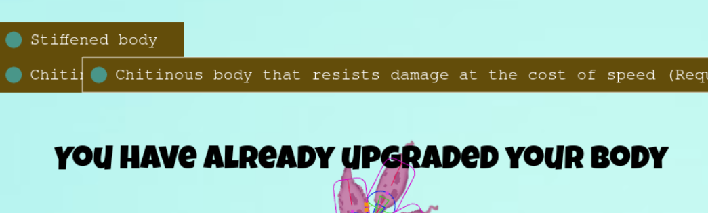
- Attempting to take the chitin upgrade when your body is already upgraded.

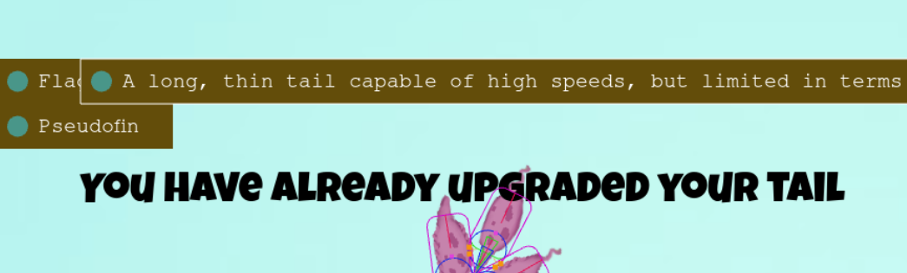
- Attempting to take the flagellum upgrade when your tail is already upgraded.
- Note that the overlapping menu item has been corrected since this image was taken

- Attempting to take the pseudotail upgrade when your tail is already upgraded.
***
### Win conditions
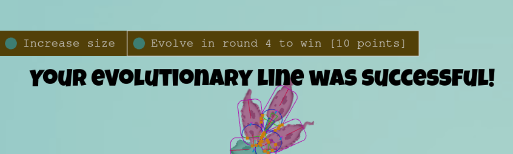
- Purchasing the win condition during round 4 with 10 evo points.

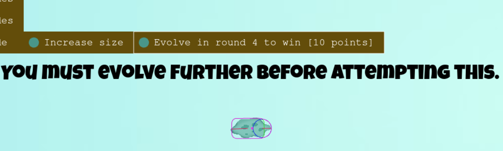
- Attempting to purchase the win condition while not in round 4.
***
### Not enough points
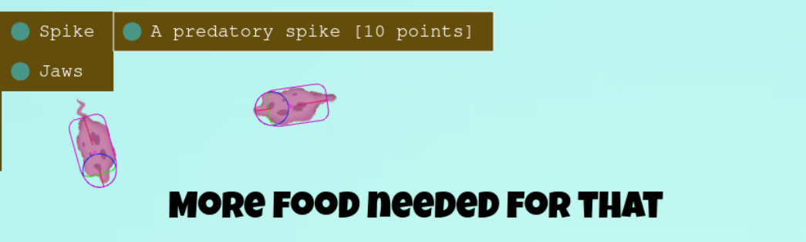
- Attempting to purchase spike without enough points.

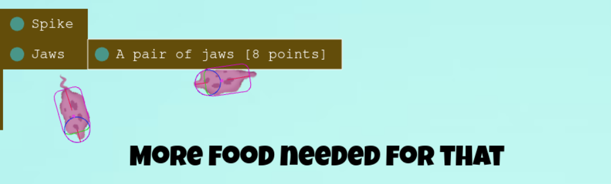
- Attempting to purchase jaws without enough points.

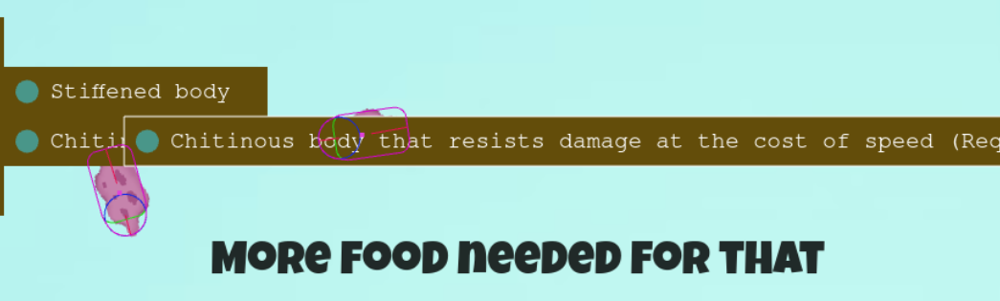
- Attempting to purchase chitin without enough points.
- Note that the overlapping menu item has been corrected since this image was taken

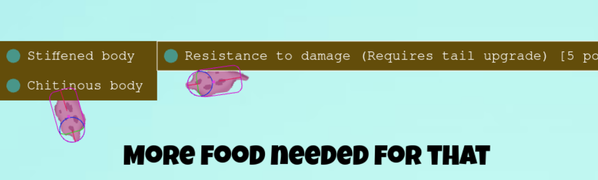
- Attempting to purchase stiff body without enough points.

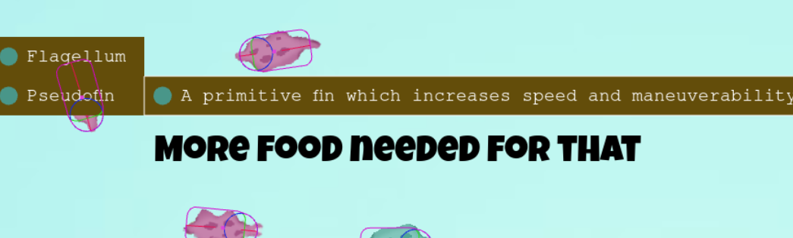
- Attempting to purchase tail without enough points.

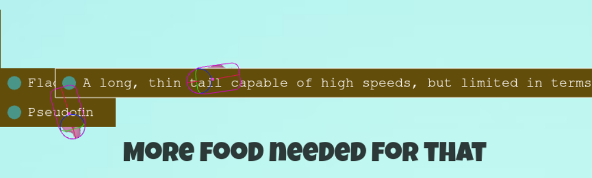
- Attempting to purchase flagellum without enough points.
- Note that the overlapping menu item has been corrected since this image was taken
***
### No tail upgrade for body upgrade

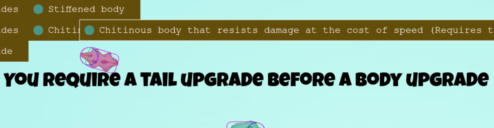
- Attempting to purchase chitinous body without tail upgrade.
- Note that the overlapping menu item has been corrected since this image was taken

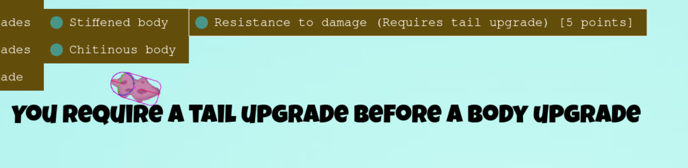
- Attempting to purchase stiff body without tail upgrade.

[Back to top](#Table-of-contents)
***
***
### Point display
The point display element is a part of the healthContainer healthbar group. Any change to the value of the evolution points like eating food or starting a new round triggers a change in the counter. When the counter ticks up to 10, the font size is reduced to make space for centering both digits within the round frame.

- The points change as food is acquired, and return to 0 when the next round begins or when the game is started over.

- The points resize and recenter to fit within the frame when more digits are displayed. This was not tested to three digits although it is technically possible to acquire as many points as you feel like going around and collecting. However, since the highest total needed to acquire an upgrade is 10, this was considered to be outside the necessity to plan for.

[Back to top](#Table-of-contents)
***
### Health display

The health bar consists of a rounded green bar and an invisible mask sprite. The mask sprite is moved incrementally along the x axis to hide lost HP (Hit Points). The increments are determined by comparing the max HP (variable due to evolutions) to the current HP.

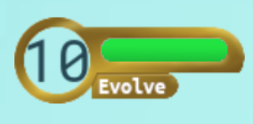
- Pictured above is the health bar as displayed with full HP.

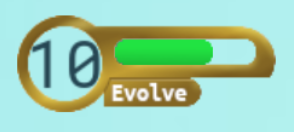
- Pictured above is the health bar as displayed with 7/10 HP.

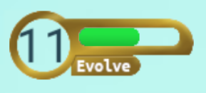
- Pictured above is the health bar as displayed with 15/25 HP.

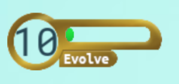
- Pictured above is the health bar as displayed with 1/10 hp

[Back to top](#Table-of-contents)
## Play area and camera

(Above: a scaled down version of the image that comprises the play area)

- The play area displays as expected in every gameplay iteration.

- The boundaries affect both the camera view and every object.

- The camera follows the player until the camera bounds are reached, and resumes following when returning to the play area.

[Back to top](#Table-of-contents)
***
## Gameplay mute button

- Upon clicking or tapping the mute button, the visual changes to show the current state. Upon muting, music pauses and all sound stops immediately. All further sounds are muted.

- Toggling the mute button off again resumes the music and allows all sounds to play as normal.

- Iterating through rounds does not affect the mute state.

- Shows that sound is muted

- Shows that sound is not muted

[Back to top](#Table-of-contents)
***
## Text display

The text display is handled by the showText() method in gameplay.js lines 509-525. It takes two variables: message and duration. The text is displayed in an always present invisible text object near the center of the screen. It automatically plays an animation fading in the message, pausing, and then fading it back out.

- Most text elements are tested as part of testing other elements. See [Evolution menu testing](#Evolution-menu), [New round testing](#New-round), and [Game Over testing](#Game-over). Because these elements do not differ functionally from any not tested, we consider this sufficient.

[Back to top](#Table-of-contents)
***
## New round

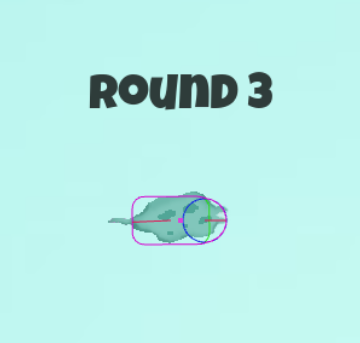

The machinery of changing rounds is fairly straightforward: Several game variables are returned to normal values, the round variable is iterated.

The beginning of a new round builds the scene as normal. The applyUpgrades() method picks up on all purchased upgrades and provides a player sprite with the correct animations. It also randomly selects upgrades for all three enemies, providing their sprites with the appropriate parts, values and animations.

- This is one of the parts of the game that has been tested endlessly throughout development. Many game mechanics are built on the changing of rounds: Selecting upgrades for enemies, applying appropriate movement and idle animations to the player and enemies, selecting evolutions and more.

[Back to top](#Table-of-contents)
***
## Game over

Both the victory and loss screens display an appropriate message, play an appropriate sound, fade to black, and return to the menu screen.

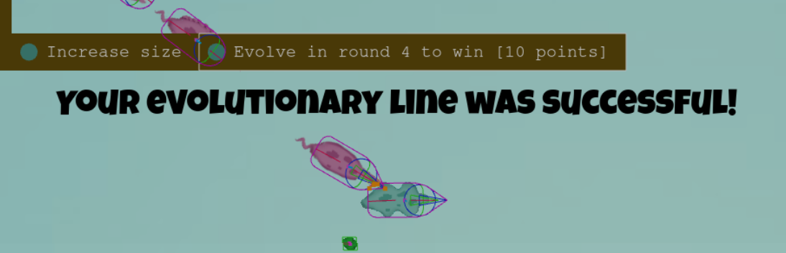
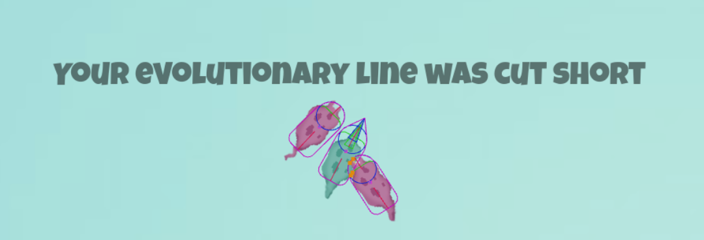

- Through multiple iterations of tests, all elements of the victory and loss screens worked as expected.
- Further iterations of the game after returning to the menu screen after victory or loss work as normal.

[Back to top](#Table-of-contents)
***
## Sensor interactions

Probably the most sensitive area of testing. All sensor interactions are handled by a large tree of statements located on lines  626-742.

626-656 simply gathers information about the bodies that are interacting to determine if one of them has a sensor, and then categorizing them into the sensor body and the other body. The rest of the interaction code works with the output of this mechanism.

- The bulk of these interactions form the backbone of the game. The interactions are relatively simple and straightforward, and - other than the keyboard movement controls - are the best tested part of the game.
***
### Lines 659-674: Player jaws damage enemy body
- The enemy body is correctly identified consistently.
- The player's jaws are correctly identified consistently.
- The player's mouth is never mistakenly treated as jaws.
- Damage is consistently applied to the enemy body, and the enemy sprite always presents the tint and sound effects.
### Lines 676-691: Player spike damages enemy body
- The enemy body is correctly identified consistently.
- The player's spike is correctly identified consistently.
- The player's spike is never damaged by enemy jaws.
- Damage is consistently applied to the enemy body, and the enemy sprite always presents the tint and sound effects.
### Lines 693-705: Player eating food
- Green food is always identified, eaten and destroyed consistently.
- Red food is sometimes misidentified and fails to be eaten. See [Known issues here](README.md#"Red-food").
- Points are consistently awarded for eating food.
### Lines 710-737: Enemy sensor interactions
- Damage is consistently applied to the player
- Food is consistently eaten and destroyed by the enemies
- Sound and tint effects are consistently applied to the player by attacks

[Back to top](#Table-of-contents)
***
# JSHint
Note that all errors related to ES6 have been disabled for the purposes of this assessment.
****
## gamesettings.js
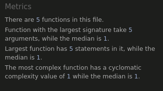

The gamesettings.js file is very straightforward. It produces no errors other than empty references to other JS files, which can be ignored.
***
## preloader.js
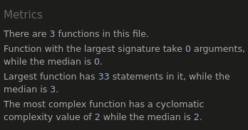

The preloader.js files is a simple preloader, containing only functions to bypass the menu screen when debugMode is true. It produces no errors other than empty references to other JS files, which can be ignored.
***
## menuscreen.js
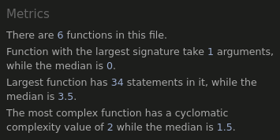

The menuscreen.js file contains a lot of animations and not much else. The simplicity is reflected here. It produces no errors other than empty references to other JS files, which can be ignored.
***
## objects.js
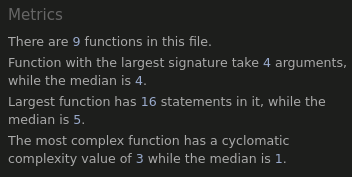

The objects.js file contains classes called from the gameplay.js file. It produces no errors other than empty references to other JS files, which can be ignored.
***
## gameplay.js
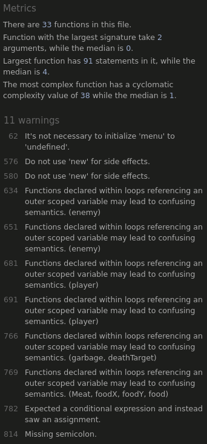

The gameplay.js file contains the bulk of the interactive elements of the game. 

- The high cyclomatic complexity comes primarily from two functions: the one used by the menu to apply upgrades to the player, and the one used to select and apply random upgrades to the enemies. They need to be so complex because of the coding system used to select the correct animation for the set of upgrades chosen in either case. See [Features](README.md#Features) for more information.

- Line 62: "It's not necessary to initialize 'menu' to 'undefined'". Unfortunately, it is. The menu screen launches a new scene, and without reinitializing the menu to 'undefined', the menu automatically opens at the beginning of the following round.

- Lines 576/580: "Do not use 'new' for side effects." This is because new is intended to be used to assign a class to a variable. I could be more verbose and assign a variable, but in this library, these classes are assigning themselves to display lists and have accessible references there. I chose to be less verbose.

- Lines 634, 651... etc.: While these semantics may be confusing, they are necessary and thoroughly commented to allay any confusion.

- Lines 782, 814: These errors have been corrected since this screenshot was taken.

[Back to top](#Table-of-contents)
***
# CSS Validation

- The CSS is 7 lines.

***
[Back to top](#Table-of-contents)

# HTML Validation

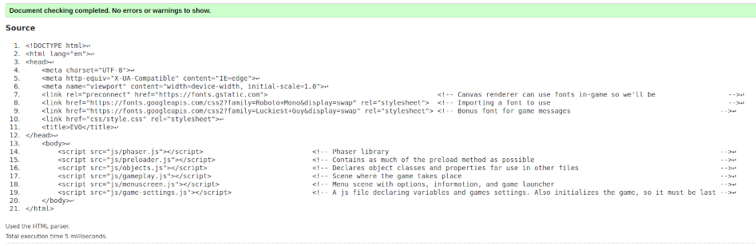

- The HTML is 25 lines.

***
[Back to top](#Table-of-contents)